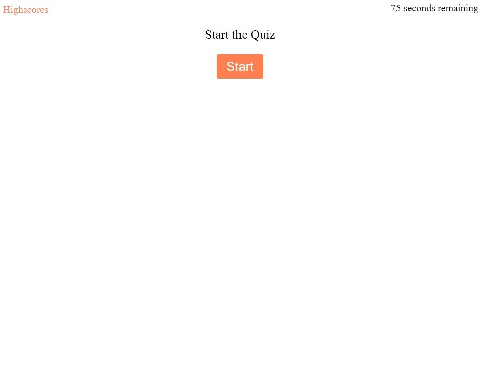
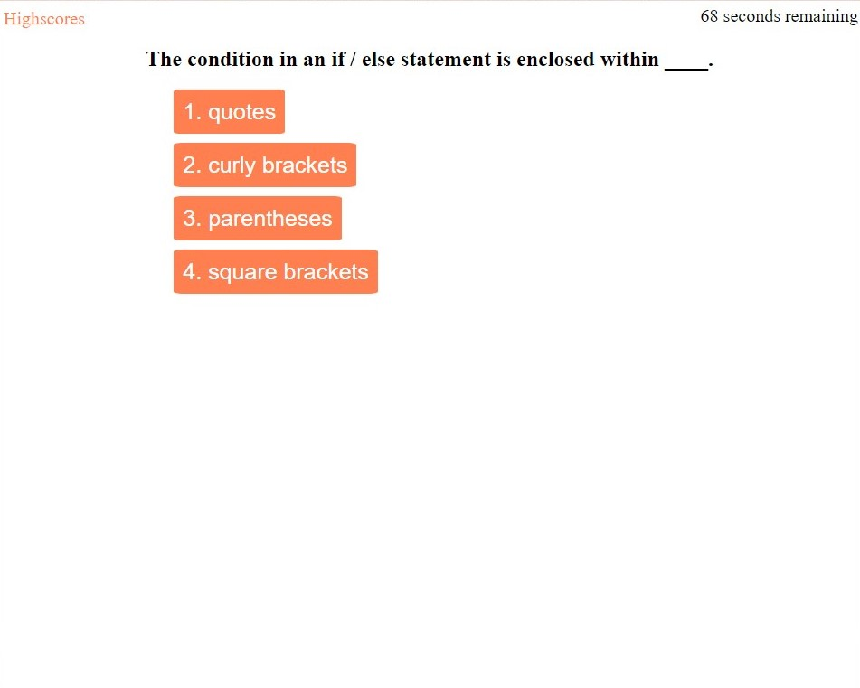
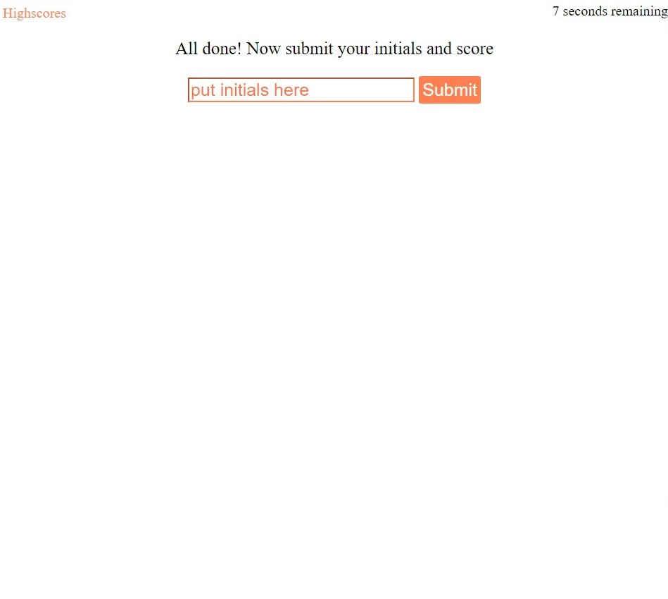
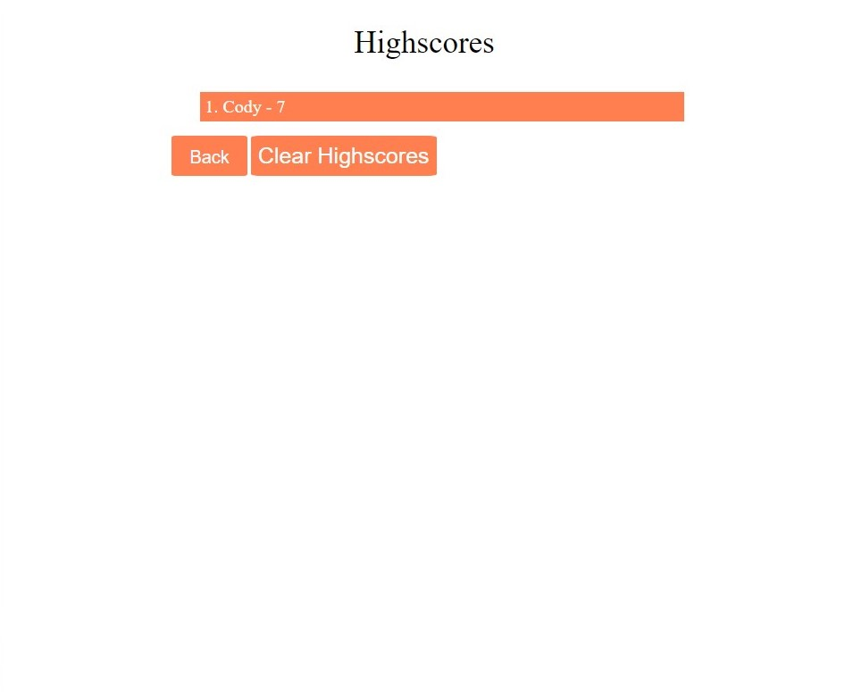

This is an online code quiz. Answer five questions within the 75 second time limit. Your score is how much time you have left when the quiz is over. Be careful, get a question wrong and take a 15 seconds time penalty. Be sure to check the highscores page to see your scores.

https://codyyuill.github.io/CodeQuiz/index.html